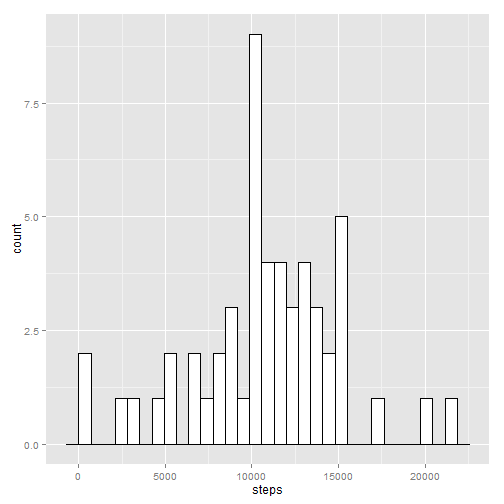
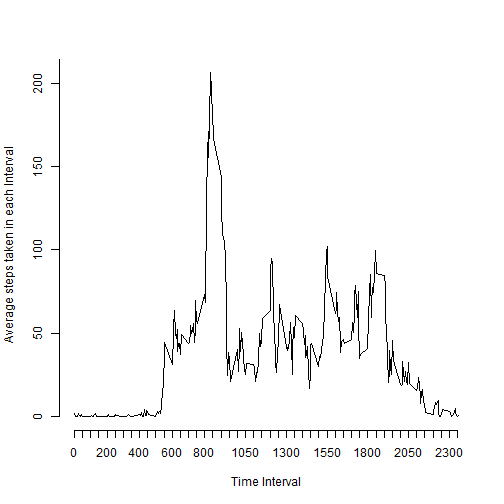
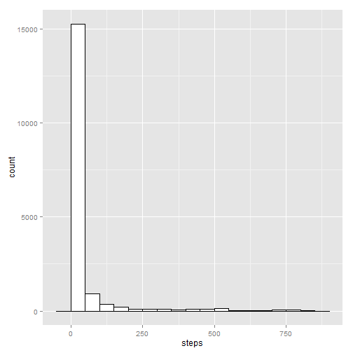
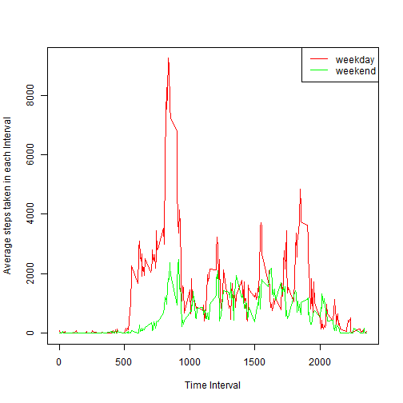

#Loading and Pre-processing the data

```r
setwd("C:/Users/ravi.verma/Desktop")
activity <- read.csv("C:/Users/ravi.verma/Desktop/activity.csv")
```

#Mean and median number of steps per day

```r
library(ggplot2)
```

```
## Warning: package 'ggplot2' was built under R version 3.1.1
```

```r
steps_per_day <- aggregate( steps ~ date, activity, sum , na.rm =TRUE )
ggplot(steps_per_day, aes(x=steps)) + geom_histogram(colour="black", fill="white")
```

```
## stat_bin: binwidth defaulted to range/30. Use 'binwidth = x' to adjust this.
```

 

```r
mean_steps <- mean(steps_per_day$steps)
print(mean_steps)
```

```
## [1] 10766
```

```r
median_steps <- median(steps_per_day$steps)
print(median_steps)
```

```
## [1] 10765
```


#Finding average daily pattern

```r
pattern <- aggregate( steps ~ interval, activity, mean , na.rm =TRUE )
plot(pattern$interval, pattern$steps, type = "l" , xlab ="Time Interval",ylab = "Average steps taken in each Interval", axes = FALSE )
axis(side=1, at=seq(0,2355 , by = 50))
axis(side=2, at=seq(0, 250, by=50))
```

 

```r
a <- pattern[pattern$steps == max(pattern$steps), ]
print(a$interval)
```

```
## [1] 835
```


#Imputing missing values by median for that 5-minute interval,

```r
length(which(is.na(activity[1])==T))
```

```
## [1] 2304
```

```r
impute <- aggregate(steps~interval, activity, median, na.rm = TRUE)
colnames(impute) <- c("interval", "imputed")
new <- merge (activity, impute, by = "interval")
na.ids <- which(is.na(new$steps))
new[na.ids,"steps"] = new[na.ids,"imputed"]
ggplot(new, aes(x=steps)) + geom_histogram(binwidth= 50, colour="black", fill="white")
```

 

```r
steps_per_day1 <- aggregate( steps ~ date, new, sum )
mean_steps1 <- mean(steps_per_day1$steps)
print(mean_steps1)
```

```
## [1] 9504
```

```r
median_steps1 <- median(steps_per_day1$steps)
print(median_steps1)
```

```
## [1] 10395
```
#It is observed that the mean and median values change.
#There is a reduction the estimates of the total daily number of steps due to imputing.


#Differences in activity patterns between weekdays and weekends

```r
day <- weekdays(as.Date(new$date))
activity_new <- cbind(new$steps,new$date,new$interval,day)
colnames(activity_new) <- c("steps","date","interval","day")
weekend <- as.data.frame(subset(activity_new, day %in% c('Saturday','Sunday')))
weekday <- as.data.frame(subset(activity_new, day %in% c('Monday','Tuesday','Wednesday','Thursday','Friday')))
weekend$steps <- as.numeric(as.character(weekend$steps))
weekday$steps <- as.numeric(as.character(weekday$steps))
steps_weekend <- aggregate( steps ~ interval, weekend, sum , na.rm =TRUE )
steps_weekday <- aggregate( steps ~ interval, weekday, sum , na.rm =TRUE )
steps_weekday$interval <- as.numeric(as.character(steps_weekday$interval))
steps_weekend$interval <- as.numeric(as.character(steps_weekend$interval))
v <- steps_weekday[with(steps_weekday, order(interval)), ]
b <- steps_weekend[with(steps_weekend, order(interval)), ]
plot(v$interval, v$steps, type = "l" , xlab ="Time Interval",ylab = "Average steps taken in each Interval" , col = "red")
lines(b$interval,b$steps,col="green")
legend("topright", c("weekday","weekend") , col = c("red","green") , lty = 1)
```

 
